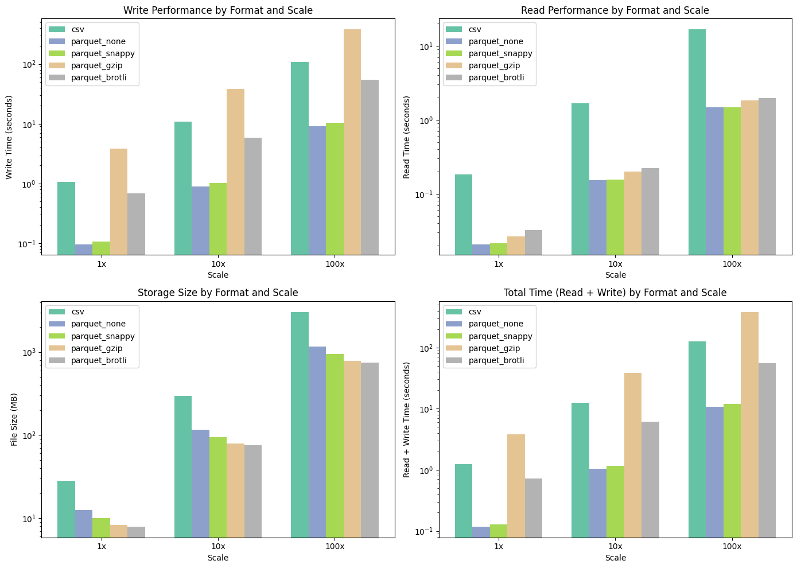
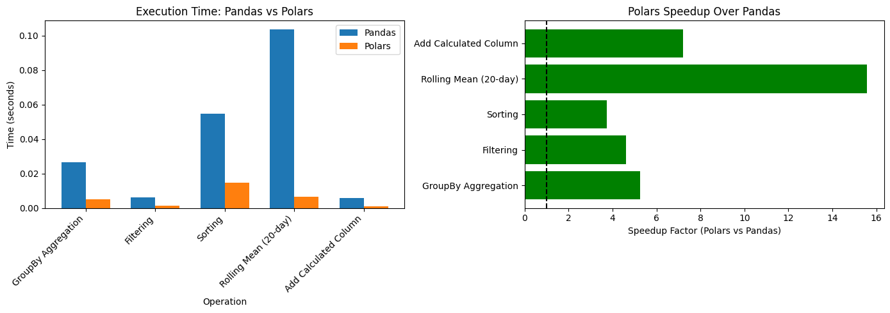
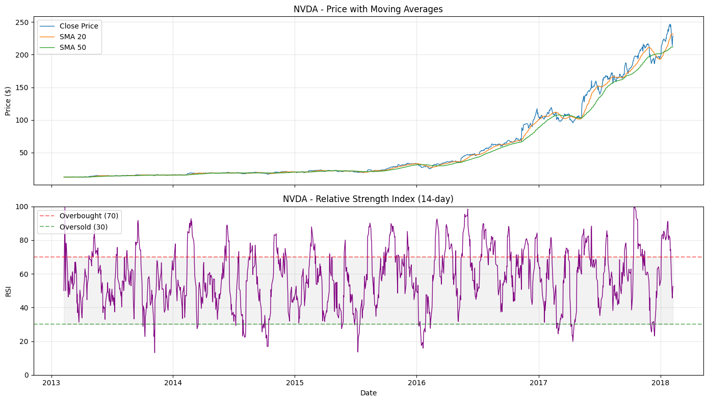
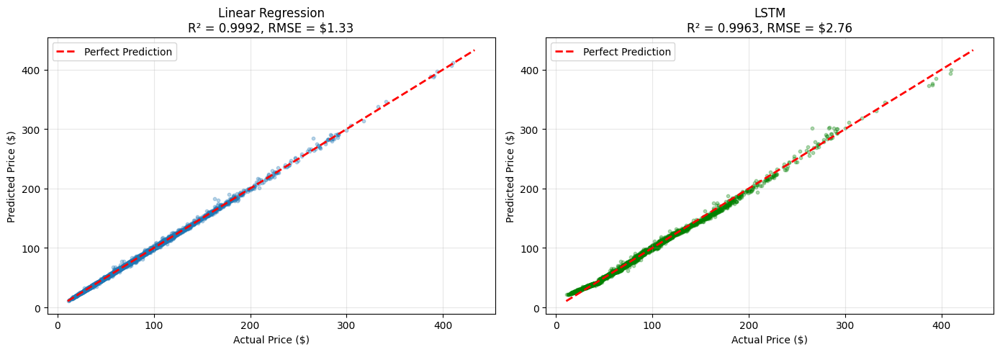
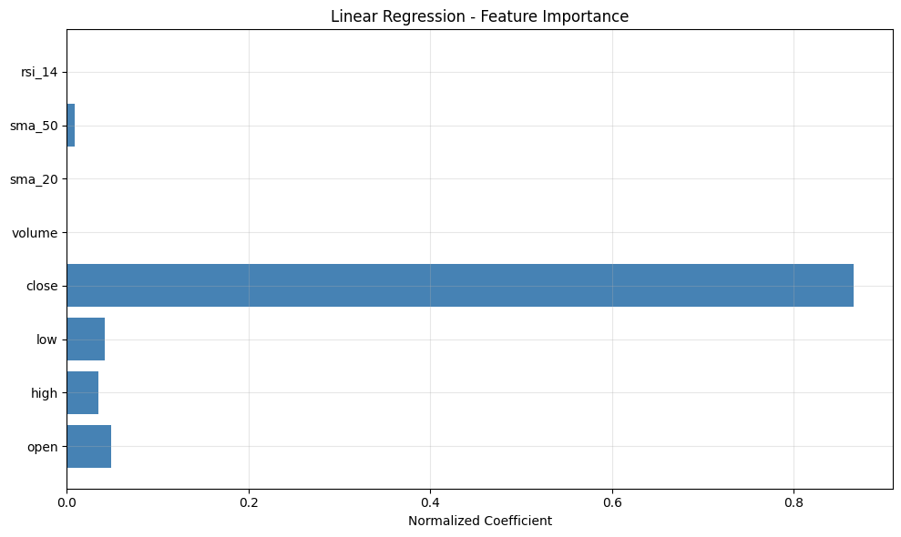
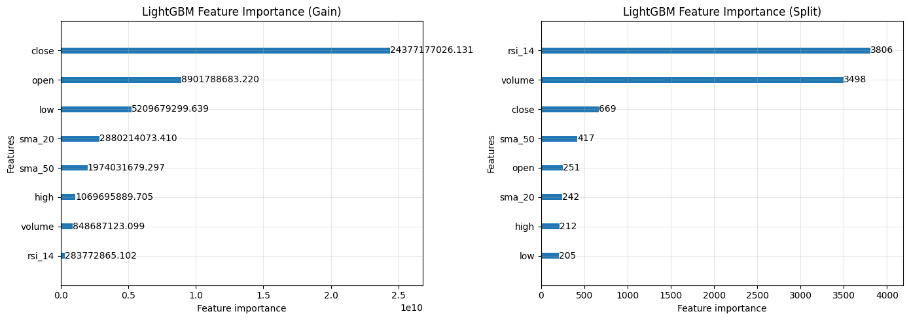

# CSIS 4260 - Assignment 1: Stock Price Analysis & Prediction

A comprehensive analysis project evaluating data storage efficiency, comparing dataframe libraries, and building predictive models for S&P 500 stock prices.

## Table of Contents
- [Project Overview](#project-overview)
- [Setup Instructions](#setup-instructions)
- [Part 1: Storage Benchmarking](#part-1-storage-benchmarking--scalability)
- [Part 2: Data Analysis & Modeling](#part-2-data-manipulation-analysis--predictive-modeling)
- [Part 3: Interactive Dashboard](#part-3-interactive-dashboard)
- [Project Structure](#project-structure)

---

## Project Overview

This project analyzes 5 years of daily stock prices for 505 S&P 500 companies (619,040 rows) across three phases.

### Dataset
- **Source**: S&P 500 Daily Stock Prices
- **Period**: 2013-02-08 to 2018-02-07
- **Records**: 619,040 rows
- **Companies**: 505 S&P 500 companies
- **Features**: date, open, high, low, close, volume, name

---

## Setup Instructions

### 1. Extract the zip file
```bash
unzip stock-analysis-a1.zip
cd stock-analysis-a1
```

### 2. Create and activate virtual environment
```bash
python -m venv .venv
source .venv/bin/activate  # On Windows: .venv\Scripts\activate
```

### 3. Install dependencies
```bash
pip install -r requirements.txt
```

### 4. Place the data file
Download `all_stocks_5yr.csv` and place it in the `data/` directory.

### 5. Run Jupyter Notebooks (Part 1 & 2)
```bash
jupyter notebook notebooks/
```

### 6. Run Dashboard (Part 3)
```bash
streamlit run src/dashboard/app.py
```

---

## Part 1: Storage Benchmarking & Scalability

### Objective
Evaluate whether to keep data in CSV format or convert to Parquet format for storing and retrieving time-series stock data.

### Methodology
- Benchmark read/write performance at **1x, 10x, and 100x** data scales
- Compare formats: CSV, Parquet (No compression), Parquet (Snappy), Parquet (GZIP), Parquet (Brotli)
- Measure: write time, read time, and file size
- Each benchmark is averaged over **5 runs** for statistical reliability

### Results Summary

| Scale | Format | Write Time | Read Time | File Size |
|-------|--------|------------|-----------|-----------|
| 1x | CSV | 1.060s | 0.183s | 28.21 MB |
| 1x | Parquet (Snappy) | 0.106s | 0.022s | 10.03 MB |
| 10x | CSV | 10.844s | 1.661s | 298.04 MB |
| 10x | Parquet (Snappy) | 1.011s | 0.155s | 94.93 MB |
| 100x | CSV | 108.503s | 16.701s | 3049.49 MB |
| 100x | Parquet (Snappy) | 10.373s | 1.468s | 948.05 MB |



### Analysis & Recommendations

**Key Findings:**
1. **Read Performance**: Parquet consistently outperforms CSV
   - 1x scale: 8.4x faster
   - 10x scale: 10.7x faster
   - 100x scale: 11.4x faster

2. **Write Performance**: Parquet (Snappy) is 10-11x faster than CSV

3. **Storage Efficiency**: Parquet (Snappy) reduces file size to 32-36% of CSV

**Compression Comparison (at 1x scale):**
| Compression | Write Speed | Read Speed | File Size | Best Use Case |
|-------------|-------------|------------|-----------|---------------|
| Snappy | 10x faster | 8x faster | 36% of CSV | **General purpose - Recommended** |
| GZIP | 3.6x slower | 7x faster | 29% of CSV | Cold storage, archival |
| Brotli | 1.5x faster | 6x faster | 28% of CSV | When size is critical |

**Final Recommendation**: **Parquet with Snappy compression** for all scales
- Best balance of read/write speed and compression
- File size reduced to ~1/3 of CSV
- Type preservation (no parsing errors)
- Better scalability for future data growth

> **Note**: GZIP offers better compression but has significantly slower write performance (even slower than CSV). Use only for infrequently updated archival data.

---

## Part 2: Data Manipulation, Analysis & Predictive Modeling

### Objective
1. Compare Pandas vs Polars performance
2. Enhance dataset with technical indicators (SMA, RSI)
3. Build prediction models for next-day closing price

---

### Library Comparison: Pandas vs Polars

| Operation | Pandas | Polars | Speedup |
|-----------|--------|--------|---------|
| GroupBy Aggregation | 0.028s | 0.005s | **6.0x** |
| Filtering | 0.007s | 0.001s | **4.9x** |
| Sorting | 0.054s | 0.015s | **3.7x** |
| Rolling Mean (20-day) | 0.076s | 0.006s | **12.0x** |
| Add Calculated Column | 0.005s | 0.001s | **6.4x** |
| **Average** | - | - | **6.6x** |



**Key Findings:**
- Polars is **6.6x faster on average** across all operations
- **Rolling operations show 12x speedup** due to Polars' parallel processing and Rust backend
- GroupBy/Filtering also improved by 5-6x
- Total feature engineering: Pandas 0.53s vs Polars 0.05s (**10.6x faster**)

**Conclusion:** Use **Polars** for large-scale data processing. Use Pandas only when ecosystem compatibility is required.

---

### Feature Engineering: Technical Indicators

**Features Used (8 total):**
```
open, high, low, close, volume, sma_20, sma_50, rsi_14
```

| Indicator | Description | Purpose |
|-----------|-------------|---------|
| SMA 20 | 20-day Moving Average | Short-term trend |
| SMA 50 | 50-day Moving Average | Medium-term trend |
| RSI 14 | 14-day Relative Strength Index | Overbought/Oversold detection |



**Observations from NVDA Example:**
- Stock price increased **~10x** from 2013-2018 ($25 → $240)
- SMA 20/50 crossovers indicate trend reversals
- RSI frequently above 70 → sustained bullish momentum
- RSI drop below 20 in early 2016 marked a temporary correction

---

### Predictive Models

**Model 1: Linear Regression**
- Simple, interpretable baseline model
- Assumes linear relationship between features and target

**Model 2: LightGBM (Gradient Boosting)**
- Gradient boosting decision tree algorithm
- Parameters: num_leaves=31, learning_rate=0.05, n_estimators=500
- Early stopping with patience=50

### Model Performance (80-20 Train-Test Split)

| Metric | Linear Regression | LightGBM | Winner |
|--------|-------------------|----------|--------|
| R² Score | **0.9992** | 0.9988 | LR |
| RMSE | **$1.33** | $1.58 | LR |
| MAE | **$0.78** | $0.85 | LR |
| Training Time | **0.04s** | 3.4s | LR |



**Observations from Scatter Plots:**
- Linear Regression: Points tightly clustered along the perfect prediction line
- LightGBM: Slightly more scatter than Linear Regression
- Both models perform well across all price ranges, but LR is marginally better



**Linear Regression Feature Importance:**
- `close`: **85% of total importance** - dominates all other features
- `open`, `high`, `low`: ~5% each - daily price range contributes marginally
- `sma_20`, `sma_50`, `rsi_14`, `volume`: **negligible contribution**



**LightGBM Feature Importance Analysis:**
- **By Gain**: `close` dominates with highest information gain
- **By Split**: `rsi_14` and `volume` have most splits (model explores these features)
- Interesting contrast: high split count ≠ high predictive value
- This confirms stock price autocorrelation: tomorrow's price ≈ today's close

**Key Insights:**

1. **Linear Regression outperforms LightGBM:**
   - Strong **autocorrelation** in stock prices (today's price ≈ tomorrow's price)
   - Linear relationships are sufficient for this prediction task
   - LightGBM's complexity provides no advantage; in fact, LR is slightly better (R² 0.9992 vs 0.9988)

2. **Caution on interpreting R² > 0.99:**
   - High R² does not necessarily mean a "good" model
   - "Tomorrow ≈ Today" is too powerful a baseline
   - Predicting **price change (returns)** would be more practically useful

3. **Technical indicators (SMA, RSI) provided limited value:**
   - All predictive power comes from current price (`close`)
   - For next-day prediction, technical indicators are mostly redundant
   - These may be more useful for longer-term predictions or classification tasks

**Conclusion:** **Linear Regression recommended** for next-day price prediction. Simple, fast, and interpretable. The model essentially learns: `next_close ≈ close`. LightGBM provides no meaningful improvement for this task. Consider predicting returns or using multi-day sequences for more meaningful predictions.

---

## Part 3: Interactive Dashboard

### Technology Choice: Streamlit

**Why Streamlit?**
- Python-native: No JavaScript/HTML required
- Rapid prototyping: Build interactive apps in minutes
- Built-in widgets: Dropdowns, sliders, date pickers
- Plotly integration: Interactive, professional charts
- Easy deployment: Streamlit Cloud or self-hosted

### Dashboard Features

1. **Stock Selection Panel**
   - Search by ticker symbol
   - Dropdown with all 505 companies
   - Date range filter

2. **Model Performance Metrics**
   - R², RMSE, MAE for both models

3. **Interactive Charts**
   - Price chart with predictions overlay
   - Technical indicators (RSI)
   - Actual vs Predicted scatter plots
   - Error distribution histograms

4. **Data Table**
   - Recent 20 rows of selected stock
   - Shows predictions alongside actual prices

### Running the Dashboard
```bash
streamlit run src/dashboard/app.py
```
Access at: http://localhost:8501

---

## Project Structure

```
stock-analysis-a1/
├── data/                           # Data files
│   └── all_stocks_5yr.csv
├── notebooks/
│   ├── part1_storage_benchmarking.ipynb   # Storage format benchmarks
│   └── part2_analysis_modeling.ipynb      # Analysis and ML models
├── src/
│   ├── models/
│   │   ├── __init__.py
│   │   ├── feature_engineering.py         # Technical indicators
│   │   ├── linear_regression_model.py     # LR model class
│   │   └── random_forest_model.py         # RF model class
│   └── dashboard/
│       └── app.py                         # Streamlit dashboard
├── requirements.txt                # Python dependencies
└── README.md                       # This file
```

---

## Dependencies

Key libraries used:
- **pandas** (2.0+): Data manipulation
- **polars** (0.20+): High-performance data processing
- **pyarrow** (14.0+): Parquet file support
- **scikit-learn** (1.3+): Machine learning models
- **lightgbm** (4.0+): Gradient boosting model
- **streamlit** (1.29+): Interactive dashboard
- **plotly** (5.18+): Interactive visualizations
- **matplotlib** (3.7+): Static plots in notebooks

---

## Author

CSIS 4260 - Data Management and Visualization
Douglas College

## License

This project is for educational purposes only.
